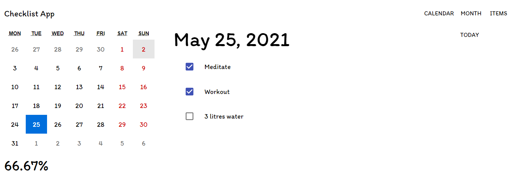
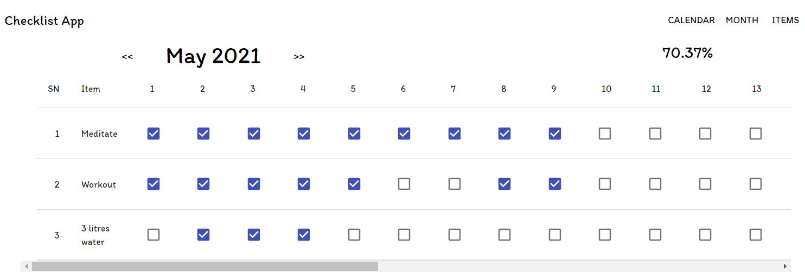
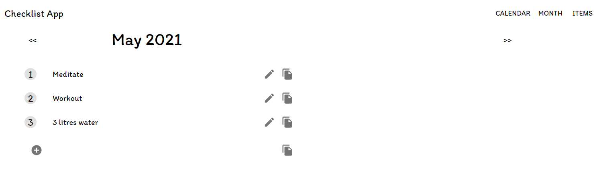

# Daily checklist

1. [Introduction](#introduction)
2. [Getting Started](#getting-started)
3. [Usage](#usage)
4. [Screenshots](#screenshots)
5. [Dependencies](#dependencies)
6. [Technical Notes](#technical-notes)

## Introduction

Daily checklist helps you track activities that you have to do daily. For each month, you can add activities (items). The app then generates a checklist for each item for each day.

Using the application, you can:
1. Add to-do items for a month.
2. Check/uncheck items for each day.
3. Switch into daily view or monthly view.
4. Copy to-do items from a previous month to the current month.
5. See the to-do items completed in percent.

## Getting Started

1. Clone the repo

2. In the project directory, install all the dependencies using:

  `yarn`

3. Run the project using:

  `yarn start`

The app runs on http://localhost:3000.

## Usage

The website opens with the current day in the daily view. Here, you can:

1. Switch dates.
2. Check or uncheck to-do items.
3. Jump to **Today**.
4. Switch to **Month** view.
5. Go to the **Items** page to add to-do items.

In the **Month** page, you can:

1. View the checks for all the days in the selected month.
2. Check or uncheck to-do items.
3. Switch months.

In the **Items** page, you can:

1. View all the to-do items in the selected month.
2. Add or edit to-do items.
3. Copy all or some to-do items to the current month.

## Screenshots

1. Home page (Daily view)

2. Month view

3. Items

## Dependencies

1. @material-ui/core ^4.11.4
2. @material-ui/icons ^4.11.2
3. react-calendar ^3.4.0

## Technical Notes

1. The app uses browser's local storage to store the ideas. So make sure to export your ideas before clearing browser data.

2. You can edit the functions inside `src/helpers/storage.js` to implement data storage using API, database, or files.
